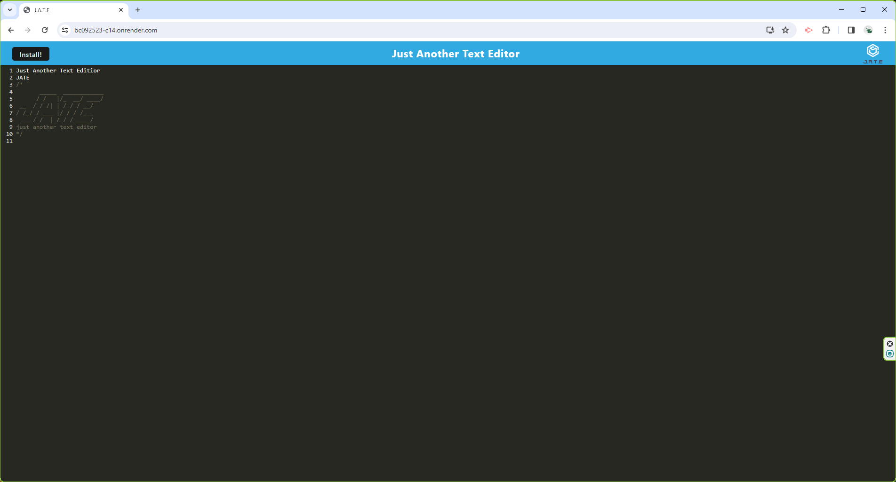

# Text Editor Progressive Web Application (PWA)

## Description

In today's fast-paced world, developers often find themselves needing to jot down quick notes or snippets of code, whether it's an idea that strikes them during a meeting or a solution to a problem that they stumble upon while browsing online resources. However, relying on traditional note-taking applications or code editors might not always be practical, especially when internet connectivity is spotty or unavailable. The Text Editor Web Application addresses this challenge by providing developers with a lightweight, yet powerful tool for creating and storing notes and code snippets directly within their web browser. Unlike traditional applications that rely solely on cloud-based storage solutions, this web application leverages the capabilities of IndexedDB, a browser-based database system, to ensure that users can access their content even when offline. Key features of the Text Editor Web Application include offline access, support for modern web technologies like webpack and Workbox, an intuitive user interface, cross-platform compatibility, and customization options. By combining the convenience of a web-based text editor with the reliability of local storage and the power of modern web technologies, the Text Editor Web Application empowers developers to capture their ideas, snippets, and insights whenever inspiration strikes, ensuring that no brilliant thought or ingenious solution is ever lost or forgotten.

## Table of Content

- [Installation](#installation)
- [Usage](#usage)
- [Contributing](#contributing)
- [License](#license)
- [Testing](#testing)
- [Questions](#questions)
- [RenderURL](#RenderURL)
- [Screenshot](#screenshot)

## Installation

To install Text Editor Progressive Web Application, make sure you have Node.js, webpack, and webpack-cli installed on your machine. Clone this repository to your local system and navigate to the project directory. Once there, run the following command to install the required dependencies: npm install node@20.11.1 webpack@5.90.3 webpack-cli@5.1.4

## Usage

After installing the dependencies, you can npm run start, to launch the application.

## Contributing

Contributing to Text Editor Progressive Web Application (PWA) is welcome! If you'd like to enhance the functionalities or fix issues, please follow these steps: 1) Fork the repository 2) Create a new branch for your feature or bug fix 3) Make your changes and commit them 4) Push your changes to your fork 5) Open a pull request to the main branch.

## License

[MIT License](https://opensource.org/licenses/MIT)

## Testing

Text Editor Progressive Web Application does not have automated tests, but you can manually test its functionality by following these steps: 1) Ensure that the application is installed and dependencies are installed correctly. 2) Run the application using “npm run start”. 3) Verify that the application behaves as expected and performs the desired operations.

## Questions

[github profile](https://github.com/wchoi888)

Please contact me on this email wchoi@rocketmail.com

## RenderURL

https://bc092523-c14.onrender.com

## Screenshot

